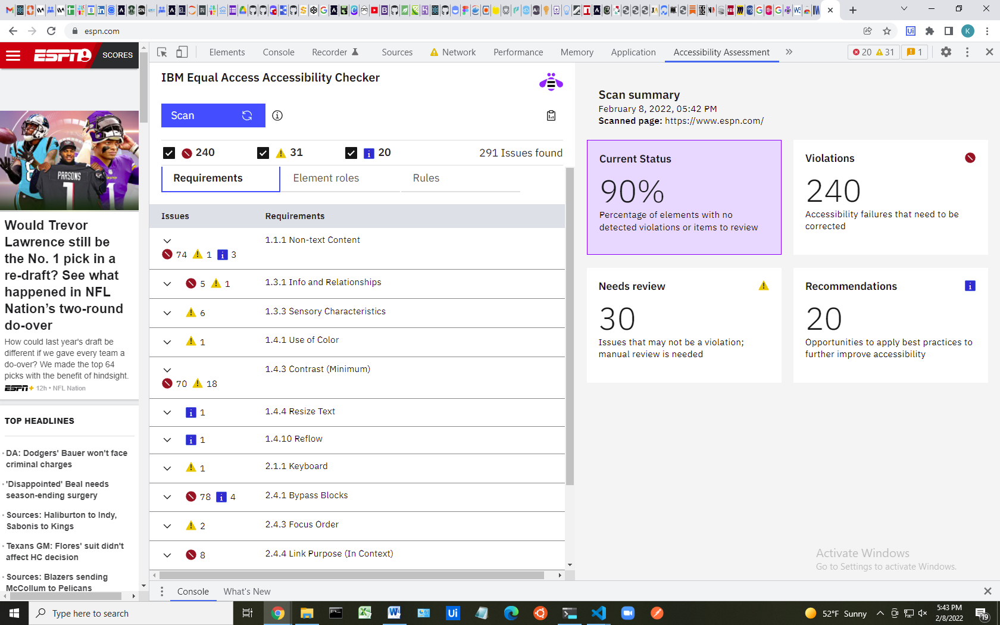
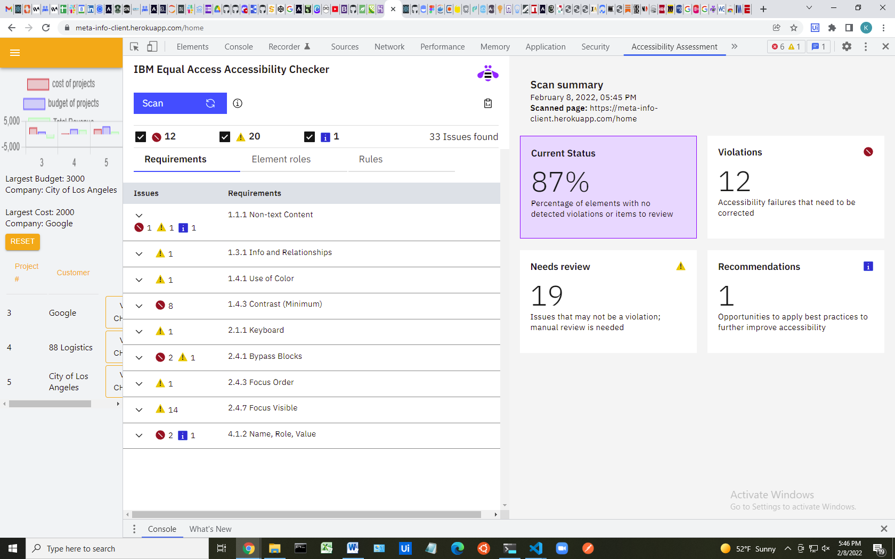

# Human Experience

### With this module, you'll learn how to build products that users love by empathizing with the target customers, understanding their problems, and working more collaboratively with designers on your team.

## Topics

   
<b>Design Fundamentals</b>
 

   Learn to use basic design terminology, and have an understanding of human experience design as it relates to their work.

   #### Learning Outcomes
   * Explain the value of human experience in the software development process

      
<ul><li>Human experience is crucial when software developing because you are developing software to solve problems that exist with humans. Very rarely will you develop software that does not have humans as the user, so it's important to take that into account during the development process. Designing software that is specific to the needs of your human clients and their users is key to building quality software. Making error codes that speak in a way that is conducive to your clients and their users is one such element. Factoring in outside problems beyond the scope of the actual business can be key in making quality software, such as many people using video streaming services due to the pandemic. It will be very hard to produce software of the highest quality without factoring the human equation.</li></ul>

   * Describe the basics of UI and UX design as it relates to building software

      
<ul><li>UX design is really the big picture of the app design. UX design is like the wireframe, in which the overall layout and features of the application are designed. The UI is more visual based and is purposed around how the user will interact with the application. I like to think of the UX being more the function of the app, while the UI is the styling or CSS of the app.</li></ul>

   * Distinguish the difference between good and bad design in software

      
<ul><li>Bad design in software starts with developing a product that doesn't address the issues of the clients users. The big part of design is the "why" and if the software doesn't accurately address that, then it is a bad design.</li><li>Software that has many features that detract from the main purpose of the application is also bad design. You don't want to flood your user's senses with "useless noise". This abundance of features can lead to frustration from your users, as well as slow down the speed of your application, so its important to know your target audience when designing.</li><li>Good design in software is one in which the application and its features are easily accessible. You don't want users to have to jump through hoops to access their data, nor do you want the data to be displayed in a way in which the user does not understand. This will lead to confusion and frustration which are not attributes of well designed software.</li></ul>

   #### Resources
   * [10 Usability Heuristics for User Interface Design - Nielsen Norman Group `Article`](https://www.nngroup.com/articles/ten-usability-heuristics/)
   * [Human-Centered Design Is More Important Than Ever `Article`](https://www.bcg.com/publications/2020/the-importance-of-human-centered-design)
   * [UX Design vs UI Design - What's The Difference? `Video`](https://www.youtube.com/watch?v=5CxXhyhT6Fc)
   * [What is User Experience (UX) Design? `Article`](https://www.interaction-design.org/literature/topics/ux-design)
   * [The Design of Everyday Things `Book ($)`](https://www.amazon.com/Design-Everyday-Things-Revised-Expanded/dp/0465050654)

   #### Exercises
   * [Digital Product Design Assessment](../exercises/human-experience/digital-product-design-assessment.md)

      <ul><li><a href="https://docs.google.com/document/d/1_t-68P7BI_xWEv7_u2YoF1PxqmVfS0uMt44Iuw73i08/edit?usp=sharing">Google doc for my exercise</a></li></ul>

      
<ul><li>The conclusion I got from this exercise is that I learned to breakdown an app that I already frequently use into the 2 parts of UX and UI. I observed where it did things well and areas that need improvement. This exercise stretched me because it made me observe an app into a way that I had never thought about it previously.</li><li>What surprised me about this exercise was how I was able to break down the app and distinguish it into the 2 parts.</li><li>An excellent digital product is one in which the UX and UI are blended seamlessly and work in harmony. You want an application that solves the "why" of the problem it is trying to solve, while also having a user-friendly interface that allows for easy readability and accessability</li><li>From here, I wish to continue to learn more about the design process that factors in the human experience and further the growth of my craft.</li></ul>

   * Discuss good/favorite designed products
   * Collecting inspiration
   * Go over ways the engineers can affect UX

----

   
<b>Introduction to Design Thinking</b>
 

   Build an understanding of each phase of the design thinking methodology, enough to help and support software teams in their problem-solving processes.

   #### Learning Outcomes
   * (Empathy) Identify who your users are more clearly, and recognize their pain points
   * (Define) Define a testable hypothesis statement that addresses the users' pain points
   * (Ideate) Participate in brainstorming exercises amongst yourself or in a team that helps generate many solutions to a user's problem
   * (Prototype) Assemble testable prototypes from brainstormed ideas
   * (Measure) Evaluate the success of a prototype by testing it with users

   #### Resources
   * [Design Thinking - Ideo.com `Resource`](https://designthinking.ideo.com/)
   * [What is Design Thinking - IDEO U `Article`](https://www.ideou.com/blogs/inspiration/what-is-design-thinking)
   * [What is Design Thinking and Why Is It So Popular? `Article`](https://www.interaction-design.org/literature/article/what-is-design-thinking-and-why-is-it-so-popular)
   * [Why Design Thinking Works - Harvard Business Review `Article`](https://hbr.org/2018/09/why-design-thinking-works)
   * [Creative Confidence: Unleashing the Creative Potential Within Us All `Book ($)`](https://www.amazon.com/Creative-Confidence-Unleashing-Potential-Within/dp/038534936X)
   * [Foundations in Design Thinking Certificate - IDEO U `Course ($)`](https://www.ideou.com/collections/design-thinking-courses/products/design-thinking-certificate)

   #### Exercises
   * [Process Observation (Empathy Mapping)](../exercises/human-experience/process-observation.md) 

      
<ul><li><a href="https://miro.com/app/board/uXjVOQxNPPg=/?invite_link_id=375878972380">View Board</a></li></ul>

   * Empathy Exercises: Observe and document the steps of a process
   * Ideation Exercise: Ideate and brainstorm with the team on a topic or task
   * Prototyping Exercise: Create a paper prototype

----

   
<b>Introduction to Design Systems</b>
 

   Learn how to use, contribute to, and maintain a design system for building web applications.

   
<ul><li>Is this like using material UI but having a standard in the company of when to use what and it is very specific?</li></ul>

   #### Learning Outcomes
   * Explain what a design system is

      
<ul><li>Design system is more or less a standardized way that designs are carried out. This is done to keep the overall image of the company the same, such as standardized fonts and color scheme. This keeps consistency among many platforms while still allowing the flexibility to create many different applications. This also great because it allows it allows for rapid development and more time spent on complex issues rather than on redundant design issues.</li></ul>

   * Use a design system when working on software projects
   * Contribute to an existing design system for software projects

   #### Resources
   * [A comprehensive guide to design systems - Invision `Article`](https://www.invisionapp.com/inside-design/guide-to-design-systems/)
   * [Apple's Human Interface Guidelines `Design System`](https://developer.apple.com/design/human-interface-guidelines/)
   * [Design Systems 101 - Nielsen Norman Group `Article`](https://www.nngroup.com/articles/design-systems-101/)
   * [DesignSystems.com `Resource`](https://www.designsystems.com/)
   * [Google's Material Design `Design System`](https://material.io/)
   * [IBM's Carbon `Design System`](https://www.carbondesignsystem.com/)
   * [Storybook `Tool`](https://storybook.js.org/)

   #### Exercises
   * [Login Screen with Material Design](../exercises/human-experience/login-screen-ui.md)
   * Build a simple UI layout using Material Design
   * Read Documentation in popular Design Systems or your company's own
   * Storybook exercise: Create reusable and documented UI components

----

   
<b>Accessibility and Universal Design Fundamentals</b>
 

   Learn how to build software that meets the accessibility needs of its users.

   #### Learning Outcomes
   * Explain the importance of accessibility in software

      
<ul><li>On the surface accessibility is important because it allows your users to navigate your application in a way that is easier for them. Sometimes, the applications are designed in a way that users with certain level of disabilities cannot access the data at all. This is the opposite of the desired result.</li><li>On a deeper level, it is important because it shows users with disabilities, that the development team actually cares. Having an application that is accessible to these users speaks volumes about the culture instilled at the company because these users face challenges everyday with applications that were not catered to their needs.</li></ul>

   * Develop software that meets standard accessibility requirements set forth by W3C

      
<h4>WCAG 4 core principles</h4><ol><li>Perceivable: people can see the content or hear it</li><li>Operable: people can use the computer by typing, or by voice.</li><li>Understandable: People get clear and simple language.</li><li>Robust: people can use different assistive technologies</li></ol>

   * Recognize approaches to adapt your software to various languages and regions

   #### Resources
   * [A11y `Website`](https://www.a11yproject.com/)
   * [Can I Use `Tool`](https://caniuse.com/)
   * [Funkify Disability Simulator - Chrome Extension `Tool`](https://www.funkify.org/)
   * [IBM Equal Accessibility Toolkit `Tool`](https://www.ibm.com/able/toolkit/)
   * [W3C Accessibility Fundamentals `Resource`](https://www.w3.org/WAI/fundamentals/)
   * [Why Digital Accessibility Matters - Invision `Article`](https://www.invisionapp.com/inside-design/why-digital-accessibility-matters/)

   #### Exercises
   * [Using an Accessibility Checker](../exercises/human-experience/using-an-accessibility-checker.md)

      
ESPN report</img>personal Website Report</img><h4>Steps:</h4><ul><li>Step 8. Both websites had Text contrast issues with its background that were less than the WCAG AA minimum. Both websites had countless "Content is not within a landmark element" issues.</li></ul>

      
<h4>Reflection</h4><ul><li>Each website scored fairly well, 90% for ESPN and 87% for my own personal website.</li><li>Some of the violations included text that needed to be larger and of heavier weight in contrast to the background. There were also several landmark element issues. Not sure how to fix the landmark issues but the text issues could be solved by meeting the minimum WCAG AA minimum.</li><li>I do not have a mentor yet, so there is nothing to discuss</li><li>What surprised me the most was how many errors that ESPN had, as well as how little errors my app had (given that I was unaware of accessability when I created it). I figured that ESPN being owned by a fortune 500 company (Disney), would have more awareness of accessability issues, given their size, workforce, and experience of developers. I was also very surprised that both ESPN and my own application had many of the same issues.</li><li>From here, I would like to learn how to be more accessability conscious, and implement it into the quality of my work. I would also like to learn how to improve my own app, make changes, and see my score improve.</li></ul>

   * Implement a color palette for color blindness in a webpage
   * Build a simple webpage using proper HTML semantics
   * Quiz: Define internationalization, localization, and accessibility

----

   
<b>Working with Digital Product Designers</b>
 

   Learn how to collaborate with designers in the field by understanding the role they play in the creation of quality software.

   #### Learning Outcomes
   * Explain the role a digital product designer plays on a software team

      
<ul><li>The role of the product designer is to be in tune with the clients goals, and design a product that will fit the clients needs. This role is more effective when working in tandem with the development team to increase efficiency and decrease miscommunication problems.</li><li>They capture the product vision and ensure that their end designs will meet client and user expectations.</li><li>They define the entire user experience.</li></ul>

   * Identify what you need from a designer to complete software tasks

      
<ul><li>First and foremost, to build the best quality and most efficient software, A developer would need a firm understanding of the clients needs and business goals to best accommodate them.</li><li>The designer should also present a general UX designer to give the developer a guide to follow.</li><li>The designer should present a journey map, or at least have an understanding of it, that defines the entire user experience.</li></ul>

   * Recognize standard design tools and design methodologies when working with designers

      
<ul><li>Functional analysis is a key methodology used in design. This is imperative because it sets the tone of what the application is designed to accomplish and the problem it is intended to solve. This is best achieved with a thorough understanding of the clients needs and business goals.</li><li>A standardized order of operations between designers and developers is imperative because it increases efficiency and lowers the risk of problems arising from communication errors.</li></ul>

   #### Resources
   * [6 ways for designers and developers to collaborate better - Invision `Article`](https://www.invisionapp.com/inside-design/designer-developer-collaboration-ideas/)
   * [Intro to Design Terminology `Course`](https://app.uxcel.com/courses/design-lingo)

      
<ul><li><a href="https://app.uxcel.com/home">completed the free part of the course</a></li></ul>

   * [Abstract - The Art of Design: Netflix `Film ($)`](https://www.netflix.com/title/80057883)
   * Your company's designers!

   #### Exercises
   * [Give UI/UX Design Feedback](../exercises/human-experience/give-a-designer-feedback.md)
   * Shadow or pair with a designer
   * Collaborate with a designer on UI tasks
   * Give feedback on a design to a designer (visual, and feasibility feedback)

